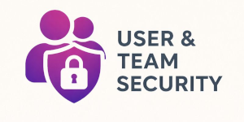
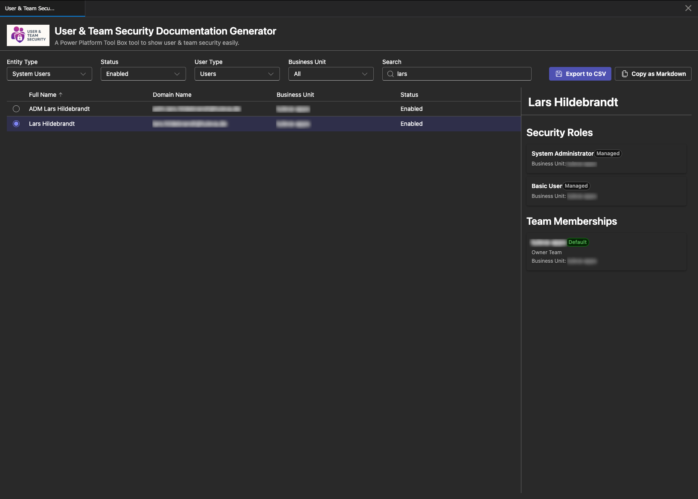
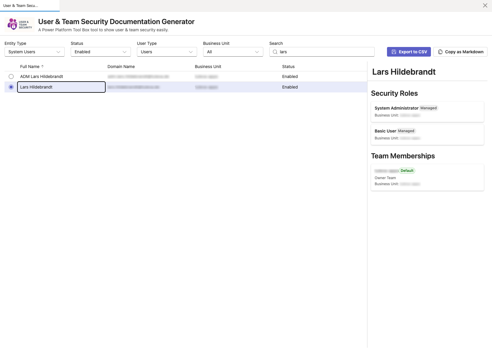

# User & Team Security Documentation Generator

<p align="center">
  
</p>

<p align="center">
  A Power Platform Tool Box (PPTB) tool for viewing and documenting Dynamics 365 user and team security configurations. This tool provides an intuitive interface to explore security roles, team memberships, and export documentation in multiple formats.
</p>

## Screenshots

### Dark Theme



### Light Theme



## Features

### Core Capabilities

- 👥 **User & Team Browser** - View all system users and teams in your Dynamics 365 environment
- 🔐 **Security Role Details** - Display directly assigned security roles for users and teams
- 👔 **Team Membership** - View all team memberships for system users
- 👥 **Team Members** - View all system users assigned to a selected team
- 📬 **Queue Memberships** - View all queue assignments for system users
- 🔍 **Advanced Filtering**:
  - Filter by entity type (System Users / Teams)
  - Filter users by status (All / Enabled / Disabled)
  - Filter users by type (All / Users / Applications) - defaults to regular users
  - Filter by business unit
  - Real-time text search across names and domains
  - Filter team members in the details panel
- 📊 **Interactive Data Grid**:
  - Single-row selection to view details
  - Sortable columns with default sorting by name
  - Resizable columns for both users and teams
  - Tooltips on hover for full text content
- 📱 **Detail Side Panel** - Displays selected user/team with:
  - All directly assigned security roles with managed status indicators
  - Team memberships (for users) with team type and default team badges
  - Team members (for teams) with searchable/filterable list
  - Queue memberships (for users) with queue type information
  - Business unit information
- 📤 **Multiple Export Formats**:
  - **CSV Matrix Export** - Roles, teams, and queues as columns, users as rows, 'X' marks assignments
  - **Markdown Export** - Copy formatted documentation to clipboard with full details
  - UTF-8 encoding with BOM for proper character support (German umlauts, etc.)
  - Windows-style line endings for better Excel compatibility
- 📢 **Visual Notifications** - Toast notifications for successful exports and errors
- 🎨 **Theme Support** - Automatic light/dark theme switching based on PPTB settings

### Technical Stack

```
- ✅ user-security-utility/
  ├── src/
  │ ├── components/
  │ │ ├── DataGridView.tsx # Data grid for users/teams with selection
  │ │ ├── Filter.tsx # Entity type, status, user type, and business unit filtering
  │ │ ├── Overview.tsx # Main container component with export functionality
  │ │ └── SecurityRolesPanel.tsx # Side panel displaying roles and team memberships
  │ ├── hooks/
  │ │ ├── useConnection.ts # Dataverse connection management
  │ │ ├── useToolboxAPI.ts # Toolbox API hook
  │ │ └── useToolboxEvents.ts # PPTB event subscription
  │ ├── services/
  │ │ ├── dataverseService.ts # Dataverse API queries for users, teams, and roles
  │ │ └── loggerService.ts # Centralized logging singleton
  │ ├── types/
  │ │ ├── systemUser.ts # System user type definitions
  │ │ ├── team.ts # Team type definitions
  │ │ ├── securityRole.ts # Security role type definitions
  │ │ └── queue.ts # Queue type definitions
  │ ├── App.tsx # Main application component
  │ ├── main.tsx # Entry point
  │ └── index.css # Global styling
  ├── icon/ # Application icons
  ├── screenshots/ # Screenshots for documentationep data to models
  ├── index.html
  ├── package.json
  ├── tsconfig.json
  └── vite.config.ts

```

## Installation

### Prerequisites

- Node.js >= 18.0.0
- npm oruser-security-utility
- Power Platform Toolbox installed

### Setup

1. Clone the repository:

```bash
git clone <repository-url>
cd pptb-plugin-documentation-generator
```

2. Install dependencies:

```bash
npm install
```

## Development

### Development Server

Start development server with HMR:

```bash
npm run dev
```

The tool will be available at `http://localhost:5173`

### Watch Mode

Build the tool in watch mode for continuous updates:

```bash
npm run watch
```

### Production Build

Build the optimized production version:

```bash
npm run build
```

The output will be in the `dist/` directory.

### Preview Build

Preview the production build locally:

```bash
npm run preview
```

## Usage

### In Power Platform Toolbox

1. Build the tool:

   ```bash
   npm run build
   ```

2. Package the tool (creates npm-shrinkwrap.json):
   tool to view users and teams

### User Interface

#### Filter Section

- **Entity Type Dropdown** (150px width): Switch between System Users and Teams
- **Status Filter** (150px width, Users only): All / Enabled / Disabled
- **User Type Filter** (150px width, Users only): All / Users / Applications (defaults to Users)
- **Business Unit Dropdown** (200px width): Filter by business unit
- **Search Box** (350px width): Real-time search across user/team names, domain names, and business units

#### Export Buttons (Users only)

- **Export to CSV**: Downloads a matrix-style CSV where:
  - Rows represent users
  - Columns represent security roles, team memberships, and queue memberships
  - 'X' marks indicate assignments
  - Includes user details (name, domain, business unit, status)
  - UTF-8 BOM encoding for proper character support
  - Comma-delimited with Windows line endings
- **Copy as Markdown**: Copies detailed report to clipboard with:
  - Hierarchical structure per user
  - Security roles with managed status and business unit
  - Team memberships with type and default indicators
  - Queue memberships with queue type information

#### Data Grid

- Click any row to select and view details
- Selected row is highlighted
- Click column headers to sort (default: sorted by name)
- Drag column borders to resize
- Hover over cells for full text tooltips
- Supports both System Users and Teams views
- Column sizing is reset when switching between entity types

#### Security Details Panel

Appears on the right when a user or team is selected:

- **Header**: Shows user/team name
- **Security Roles Section**: Lists all directly assigned security roles with:
  - Role name
  - "Managed" badge for managed roles
  - Business unit information
- **Team Memberships Section** (Users only): Lists all team memberships with:
  - Team name
  - Team type (Owner/Access)
  - "Default" badge for default teams
  - Business unit information
- **Queue Memberships Section** (Users only): Lists all queue assignments with:
  - Queue name
  - Queue type (Private/Public/Unknown)
- **Team Members Section** (Teams only): Lists all users assigned to the team with:
  - Searchable filter box
  - User full name
  - Domain name
  - Business unit information
  - "Disabled" badge for disabled users
  - Alphabetically sorted by full name

#### Evensystem users

const users = await window.dataverseAPI.queryData(
"systemusers?$select=systemuserid,fullname,domainname,isdisabled,applicationid&$expand=businessunitid($select=businessunitid,name)&$orderby=fullname"
);

// Query teams
const teams = await window.dataverseAPI.queryData(
"teams?$select=teamid,name,teamtype,isdefault&$expand=businessunitid($select=businessunitid,name)&$orderby=name"
);

// Query security roles for a user
const roles = await window.dataverseAPI.queryData(
`systemusers(${userId})/systemuserroles_association?$select=roleid,name,ismanaged&$expand=businessunitid($select=businessunitid,name)`
);

// Query teams for a user
const userTeams = await window.dataverseAPI.queryData(
`systemusers(${userId})/teammembership_association?$select=teamid,name,teamtype,isdefault&$expand=businessunitid($select=businessunitid,name)
The tool demonstrates various Power Platform Toolbox and Dataverse API features:

### Connection Management

```typescript
// Get current connection
const connection = await window.toolboxAPI.getConnection();
console.log(connection.connectionUrl);

// Listen for connection changes
window.toUser security data has been exported to CSV successfully."ata with new connection
  }
});
```

### Dataverse Queries

```typescript
// Query system users
const users = await window.dataverseAPI.queryData(
  "systemusers?$select=systemuserid,fullname,domainname,isdisabled,applicationid&$expand=businessunitid($select=businessunitid,name)&$orderby=fullname"
);

// Query teams
const teams = await window.dataverseAPI.queryData(
  "teams?$select=teamid,name,teamtype,isdefault&$expand=businessunitid($select=businessunitid,name)&$orderby=name"
);

// Query security roles for a user
const roles = await window.dataverseAPI.queryData(
  `systemusers(${userId})/systemuserroles_association?$select=roleid,name,ismanaged&$expand=businessunitid($select=businessunitid,name)`
);

// Query teams for a user
const userTeams = await window.dataverseAPI.queryData(
  `systemusers(${userId})/teammembership_association?$select=teamid,name,teamtype,isdefault&$expand=businessunitid($select=businessunitid,name)`
);

// Query team members
const teamMembers = await window.dataverseAPI.queryData(
  `teams(${teamId})/teammembership_association?$select=systemuserid,fullname,domainname,isdisabled,applicationid&$expand=businessunitid($select=businessunitid,name)`
);

// Query queues for a user
const queues = await window.dataverseAPI.queryData(
  `systemusers(${userId})/queuemembership_association?$select=queueid,name,queuetypecode&$orderby=name`
);
```

### Notifications

```typescript
// Success notification
await window.toolboxAPI.utils.showNotification({
  title: "Export Successful",
  body: "User security data has been exported to CSV successfully.",
  type: "success",
});

// Error notification
await window.toolboxAPI.utils.showNotification({
  title: "Error Loading Data",
  body: `Failed to load data from Dataverse: ${error.message}`,
  type: "error",
});
```

### File Operations

```typescript
// Save file with UTF-8 BOM encoding
const csvContent = "\uFEFF" + csvLines.join("\r\n");
await window.toolboxAPI.utils.saveFile(
  "user-security-export-2025-12-25.csv",
  csvContent
);

// Copy to clipboard
await window.toolboxAPI.utils.copyToClipboard(markdownContent);
```

### Theme Management

```typescript
// Get current theme
const theme = await window.toolboxAPI.utils.getCurrentTheme();
// Returns 'light' or 'dark'

// Listen for theme changes
window.toolboxAPI.onToolboxEvent((event) => {
  if (event === "settings:updated") {
    updateThemeBasedOnSettings();
  }
});
```

### EveToolboxAPI\*\*: Provides access to Toolbox API utilities

### Services

- **loggerService**: Singleton service for centralized logging

  - Methods: `info()`, `success()`, `warning()`, `error()`
  - Eliminates prop drilling for logging across components

- **dataverseService**: Handles all Dataverse API queries
  - Queries system users, teams, security roles, team memberships, and queues
  - Functions: `loadSystemUsers()`, `loadTeams()`, `loadSecurityRolesForUser()`, `loadSecurityRolesForTeam()`, `loadTeamsForUser()`, `loadUsersForTeam()`, `loadQueuesForUser()`
  - Implements automatic paging for large data sets using `@odata.nextLink`
  - Maps raw API responses to typed models

### Components

- **Overview**: Main container with state management for filtering, selection, and export
  - Manages loading states for roles, teams, queues, and team members
  - Implements error notifications for failed API calls
  - Handles CSV and Markdown export logic
- **Filter**: Provides all filtering controls with optimized dropdown widths
  - Entity type (150px), status (150px), user type (150px)
  - Business unit (200px), search box (350px)
- **DataGridView**: Sortable, resizable data grid using Fluent UI DataGrid
  - Separate grids for users and teams with unique keys to reset column sizing
  - Single-row selection mode
  - Cell tooltips for full text display
- **SecurityRolesPanel**: Side panel displaying comprehensive details
  - Security roles with managed badges
  - Team memberships with type and default badges
  - Queue memberships with type information
  - Team members with searchable filter and sorted display

### Export Features

- **CSV Export**: Creates a matrix format with UTF-8 BOM encoding
  - Collects all unique roles, teams, and queues across filtered users
  - Uses comma delimiter with Windows line endings (`\r\n`)
  - Marks assignments with 'X'
  - Includes user metadata (name, domain, business unit, status)
  - Progress indicator during export
- **Markdown Export**: Generates hierarchical documentation
  - Section per user with full details
  - Nested lists for security roles, team memberships, and queue memberships
  - Includes metadata like managed status, team types, queue types
  - Copies to clipboard with success notification

## Architecture

### Custom Hooks

- **useConnection**: Manages Dataverse connection state and refresh logic
- **useToolboxEvents**: Subscribes to PPTB events and handles callbacks
- **useToolboxAPI**: Provides access to Toolbox API utilities

## Data Models

### SystemUser

```typescript
{
  systemuserid: string;
  fullname: string;
  domainname: string;
  businessunitid?: {
    businessunitid: string;
    name: string;
  };
  isdisabled: boolean;
  applicationid: string | null; // Populated for application users
}
```

### Team

```typescript
{
  teamid: string;
  name: string;
  teamtype: number; // 0 = Owner, 1 = Access
  businessunitid?: {
    businessunitid: string;
    name: string;
  };
  isdefault: boolean;
}
```

### SecurityRole

```typescript
{
  roleid: string;
  name: string;
  businessunitid?: {
    businessunitid: string;
    name: string;
  };
  ismanaged: boolean;
}
```

### Queue

```typescript
{
  queueid: string;
  name: string;
  queuetypecode?: number; // 1 = Private, 2 = Public
}
```

Full TypeScript coverage with:

- Interface definitions for all data models
- Type-safe API responses
- Strongly typed component props
- PPTB API types from `@pptb/types` package

## Configuration

### Vite Build Configuration

The tool uses a custom Vite configuration for PPTB compatibility:

- **IIFE format**: Bundles as Immediately Invoked Function Expression for iframe compatibility
- **Single bundle**: Uses `inlineDynamicImports` to avoid module loading issues with file:// URLs
- **HTML transformation**: Custom plugin removes `type="module"` and moves scripts to end of body
- **Chunk size limit**: Set to 1000 kB to accommodate Fluent UI bundle size

## Data Models

### PluginAssembly

```typescript
{
  pluginassemblyid: string;
  name: string;
  version: string;
}
```

### PluginAssemblyStep

```typescript
{
  id: string;
  name: string;
  sdkMessage: string;
  mode: string; // Sync/Async
  stage: string; // PreValidation/PreOperation/PostOperation
  rank: number; // Execution order
  eventHandler: string; // Full type name
  filteringattributes: string;
}
```

## Troubleshooting

### Build Issues

If you encounter chunk size warnings:

- The tool uses IIFE format which requires a single bundle
- Chunk size limit is configured in `vite.config.ts`
- This is expected for Fluent UI components

### Connection Issues

- Ensure you're connected to a Dataverse environment in PPTB
- Check the Event Log for connection-related errors
- Verify permissions to read system user, team, security role, and queue data
- Error notifications will appear automatically when API calls fail

### CSV Encoding Issues

- The tool uses UTF-8 BOM encoding for proper character support
- German umlauts (ö, ä, ü) and special characters should display correctly
- Uses comma delimiter with Windows line endings for Excel compatibility
- If issues persist, try opening the CSV in a text editor first to verify encoding

### Theme Not Updating

- The tool automatically syncs with PPTB theme settings
- Check console for theme update events
- Verify PPTB version supports theme API

## Contributing

Contributions are welcome! Please:

1. Fork the repository
2. Create a feature branch
3. Make your changes with appropriate TypeScript types
4. Test the build process
5. Submit a pull request

### GitHub Actions

The project includes automated CI/CD workflows:

#### CI Workflow (`.github/workflows/ci.yml`)

Runs on every push and pull request to `main` and `develop` branches:

- **Build and Test**:

  - Tests on Node.js 18.x and 20.x
  - TypeScript type checking
  - Build verification
  - Uploads build artifacts

- **Lint Check**:

  - Runs ESLint if configured
  - Validates code quality

- **Security Audit**:

  - Checks for npm package vulnerabilities
  - Fails on critical vulnerabilities
  - Warns on high-severity issues

- **Package Validation**:
  - Validates package.json structure
  - Creates npm-shrinkwrap.json
  - Verifies all required fields

#### Release Workflow (`.github/workflows/release.yml`)

Triggered when pushing a version tag (e.g., `v1.0.0`):

- Builds the project
- Creates distribution packages (tar.gz and zip)
- Creates GitHub release with auto-generated notes
- Attaches build artifacts to release

**To create a release:**

```bash
# Update version in package.json
npm version patch  # or minor, major

# Push with tags
git push origin main --tags
```

## License

MIT - See LICENSE file for details

## Author

Lars Hildebrandt
